<div align="center">

# 🏙️ CivicFix
### Smart Municipal Infrastructure Portal

**Project Lead: T Narayan &nbsp;|&nbsp; Event: Vibe2Ship Hackathon**  
**Track: AI & Civic Tech &nbsp;|&nbsp; Architecture: Cloud-Native Micro-Monolith**

[](https://python.org)
[](https://fastapi.tiangolo.com)
[](https://ai.google.dev)
[](https://neon.tech)
[](LICENSE)

</div>

---

## 1. Executive Summary & Vision

**CivicFix** is an advanced municipal infrastructure management platform engineered to automate hazard reporting, triage, field inspection, repair dispatch, and post-work verification.

Powered by a **dual-loop AI engine** leveraging **Gemini 2.5**, the system eradicates administrative bottlenecks, eliminates manual routing delays, and strictly enforces work verification. It seamlessly bridges the operational gap between citizens reporting local hazards and the municipal crews dispatched to resolve them.

---

## 2. Core Problem vs. Our Solution

> **The Bottleneck:** Legacy civic portals are crippled by manual triage delays, inaccurate departmental routing, suboptimal field resource allocation, and a high incidence of unverified or fraudulent repair claims.

### ✅ The CivicFix Solution

- **Dual-Loop AI Triage & Verification:** Gemini autonomously evaluates citizen image uploads to determine priority, generate metadata tags, and execute department routing. Post-repair, it performs a rigorous visual comparison of "before versus after" documentation to objectively confirm resolution.
- **Strict Data Partitioning:** A robust role-based access control (RBAC) architecture shields internal AI diagnostics, inter-departmental communications, and priority algorithms from the public domain.
- **Direct-Dispatch Pipeline:** System administrators can bypass standard inspection protocols for critical emergencies, assigning tasks directly to repair crews to accelerate response times.

---

## 3. Technical Architecture Blueprint

CivicFix is constructed on a high-performance, cloud-native stack optimized for rapid deployment, fault tolerance, and horizontal scalability. The architecture integrates FastAPI, PostgreSQL, and the Google GenAI SDK to form a cohesive cognitive routing engine.

| Layer | Technology | Function |
|---|---|---|
| **Cognitive AI** | Gemini 2.5 (Google GenAI SDK) | Executes multimodal image analysis, NLP tagging, and visual comparative verification. |
| **Backend Core** | Python (FastAPI) | Manages high-performance asynchronous request routing, state machine logic, and overarching API orchestration. |
| **Data Persistence** | PostgreSQL (Neon) / SQLite | Provides ACID-compliant, highly scalable relational storage for geographic reports, assignments, and coordination logs with dual-database hot-swap. |
| **Client Interface** | HTML5, CSS3, Vanilla JS + Tailwind | Delivers a dependency-free, highly responsive Glassmorphic dashboard engineered for maximum performance. |

### Dual-Database Replication Layer
CivicFix implements a custom dual-database interface — **SQLite** locally, **PostgreSQL on Neon** in production. The wrapper intercepts SQL at runtime, converting `?` placeholders to `%s` for PostgreSQL, enabling seamless engine hot-swaps without code refactoring.

### Mobile QR Bridge
Solves desktop reporting limits via an auto-sizing QR code wizard. Mobile users are routed to a session draft upload endpoint. If WebRTC is blocked, the interface triggers a native file selector with `capture` tags for direct camera access.

---

## 4. Role-Based Workflow Matrix

| Role | Authorized Permissions | System Restrictions |
|---|---|---|
| **Citizen** (Public) | Submit geolocation-tagged reports, view the public transparent map, track personal ticket statuses, and upvote community infrastructure issues. | Prohibited from accessing internal AI diagnostic telemetry, municipal chat logs, or backend priority weighting. |
| **Officer** (Admin) | Approve AI-generated routing, review diagnostic summaries, assign field personnel, trigger Direct-Dispatch, and authorize final resolution closures. | No restrictions. Operates with full System Administrator privileges across the platform. |
| **Reviewer** (Inspector) | Receive targeted geographic assignments, log required structural materials/coordinates, and upload certified on-site inspection photography. | Cannot override Officer routing approvals, reassign Fixer crews, or modify overarching system parameters. |
| **Fixer** (Repair Crew) | Access assigned execution tasks, view precise Reviewer resource specifications/coordinates, and upload cryptographic final resolution verification photos. | Confined strictly to an execution-only dashboard; unable to alter global ticket states outside of task completion. |

---

## 5. The Multi-Stage Workflow Lifecycle

```
[1] TRIAGE          → Citizen submits report + photo. Gemini classifies severity (1-5),
                       routes to department, generates metadata tags.

[2] APPROVAL        → Officer reviews AI params. Assigns Field Reviewer OR triggers
                       Direct-Dispatch for emergency immediate crew deployment.

[3] FIELD REVIEW    → Inspector arrives on-site, logs materials + coordinates,
                       uploads official inspection photo. Ticket → "Awaiting Approval".

[4] AI SYNTHESIS    → Officer reviews field data. Gemini synthesizes citizen report +
                       inspector log → "AI Resource & Diagnostic Summary" blueprint.

[5] EXECUTION       → Repair crew dispatched. Executes maintenance per AI blueprint.
                       Uploads final "resolved" photo upon completion.

[6] VERIFICATION    → Gemini runs multimodal before/after comparison. Visual confirmation
                       confirmed → ticket cryptographically closed as "Resolved".
```

1. **Triage (Pending):** A citizen submits an infrastructure hazard report containing photographic evidence. Gemini instantly analyzes the payload, classifying the priority severity (Levels 1-5), routing it to the appropriate municipal department, and generating precise metadata tags.
2. **Approval (Awaiting Officer Action):** Municipal Officers review the AI-suggested parameters. They may assign a Field Reviewer for further inspection or trigger the Direct-Dispatch protocol for immediate emergency crew deployment.
3. **Field Diagnostics (Reviewing):** The designated Field Inspector arrives on-site, logs necessary repair materials, precise coordinates, and uploads an official inspection photograph. The ticket state advances to "Awaiting Review Approval."
4. **AI Synthesis (Planning):** The Officer reviews the field data. Gemini synthesizes the initial citizen report and the inspector's structural log to generate a comprehensive "AI Resource & Diagnostic Summary," creating a precise blueprint for repair.
5. **Execution (Work In Progress):** Repair crews (Fixers) are dispatched. They execute the required maintenance based on the AI blueprint and upload a final "resolved" photograph upon completion.
6. **Dual-Loop Verification (Resolved):** Gemini performs a rigorous multimodal comparison between the initial hazard documentation and the final repair photograph. Upon successful visual confirmation, the ticket is cryptographically closed and marked as "Resolved."

---

## 6. Key Engineering Innovations

### 🧠 AI Diagnostics & Double-Blind Verification
- **Automated Classification:** Extracts tags, maps to 8-department taxonomy, computes severity.
- **Before/After Verification:** Gemini vision compares original and resolution photos before closing tickets — no false sign-offs possible.

### 🔒 Security Hardening
- **Path Traversal Prevention:** `pathlib` validates all file requests stay within upload boundaries; `../` sequences rejected with `403 Forbidden`.
- **SQL Parameterization:** All user inputs compiled as tuple parameters; no raw string concatenation.
- **Image Deserialization Safety:** Strict JSON parsing loops confirm file existence before PIL processing.

### 📊 Leaderboard Upserts
- PostgreSQL `ON CONFLICT (email) DO UPDATE` — dynamically increments civic points without unique key violations.

---

## 7. API Overview

| Method | Endpoint | Description |
|---|---|---|
| `GET` | `/api/reports/list` | Query active, triaged, and resolved reports |
| `POST` | `/api/reports/submit` | Submit new report; auto-triggers Gemini triage if image attached |
| `POST` | `/api/reports/resolve/{id}` | Submit resolution proof; dispatches to Gemini verification |
| `GET` | `/api/reports/track/{id}` | Track full lifecycle of a specific report |
| `POST` | `/api/reports/approve/{id}` | Officer approves/routes a report |
| `GET` | `/api/reviewer/assignments/{id}` | Fetch reviewer assignments for a report |
| `POST` | `/api/reports/approve-review/{id}` | Officer approves reviewer handover |

---

## 8. Project Structure

```
civicfix/
├── main.py                  # FastAPI app — all routes & state machine logic
├── database.py              # Dual-database adapter (SQLite ↔ PostgreSQL)
├── gemini_service.py        # Gemini 2.5 AI triage & verification engine
├── requirements.txt         # Python dependencies
├── Dockerfile               # Container config for Cloud Run deployment
├── deploy_cloudrun.sh       # GCP Cloud Run deploy script
├── templates/               # Frontend HTML (Tailwind + Vanilla JS)
│   ├── dashboard.html       # Main portal — citizen & staff dashboard
│   ├── report.html          # Report submission + QR bridge
│   ├── map.html             # Leaflet interactive hazard map
│   └── ...
├── tests/                   # Backend test suite (pytest)
│   ├── test_api.py
│   ├── test_multistage_flow.py
│   ├── test_reviewers.py
│   └── ...
└── docs/                    # Architecture diagrams, screenshots & documentation
    └── screenshots/         # Step-by-step running application screenshots
```

---

## 9. Application Walkthrough & Stage Gallery

Here is the step-by-step chronological gallery of the running project, showcasing the UI and features through the various stages of reporting and repair:

### Step 1: Main Portal Landing Page & Dashboard Hub
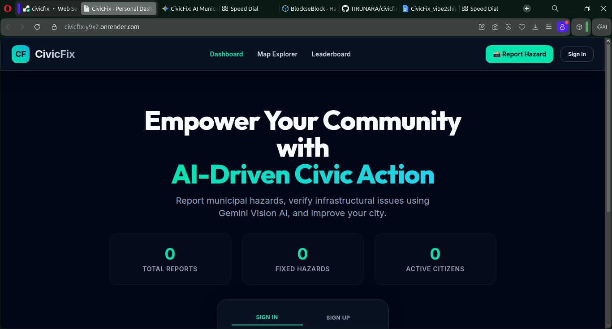

### Step 2: Citizen Hazard Reporting Portal & QR Integration Wizard
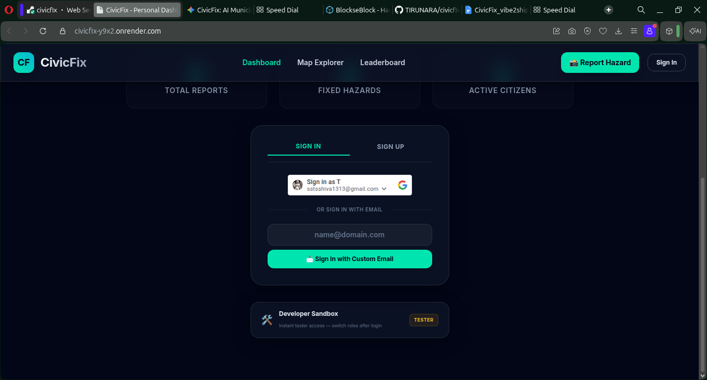

### Step 3: Interactive Hazard Geolocation & Map Coordinates Selection
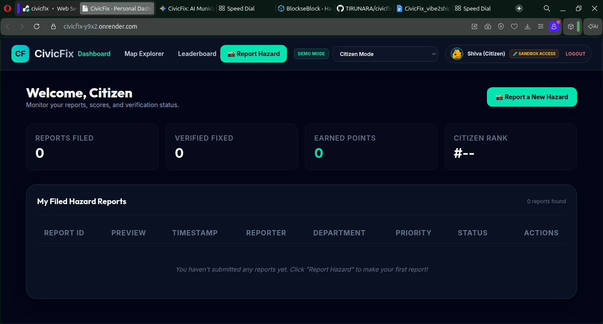

### Step 4: Submission State & Automatic Metadata Triage Ingestion
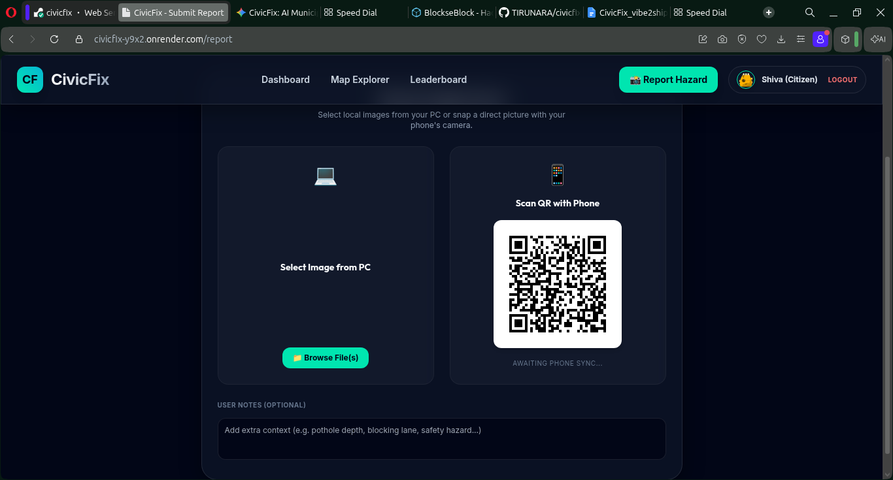

### Step 5: Officer Administrative Control Dashboard & Approvals Queue
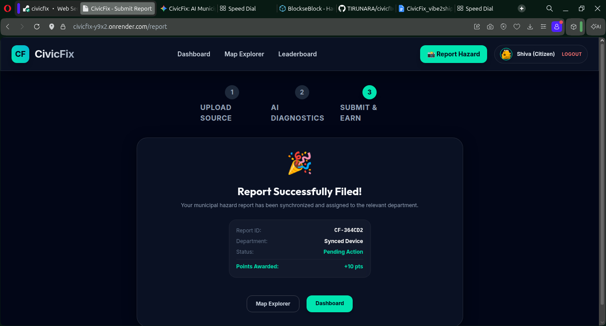

### Step 6: AI-Suggested Departmental Routing & Priority Calibration
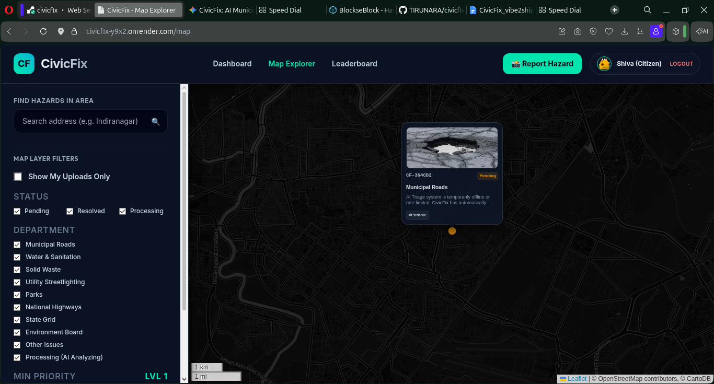

### Step 7: Dynamic Field Reviewer Assignment & Coordinate Mapping
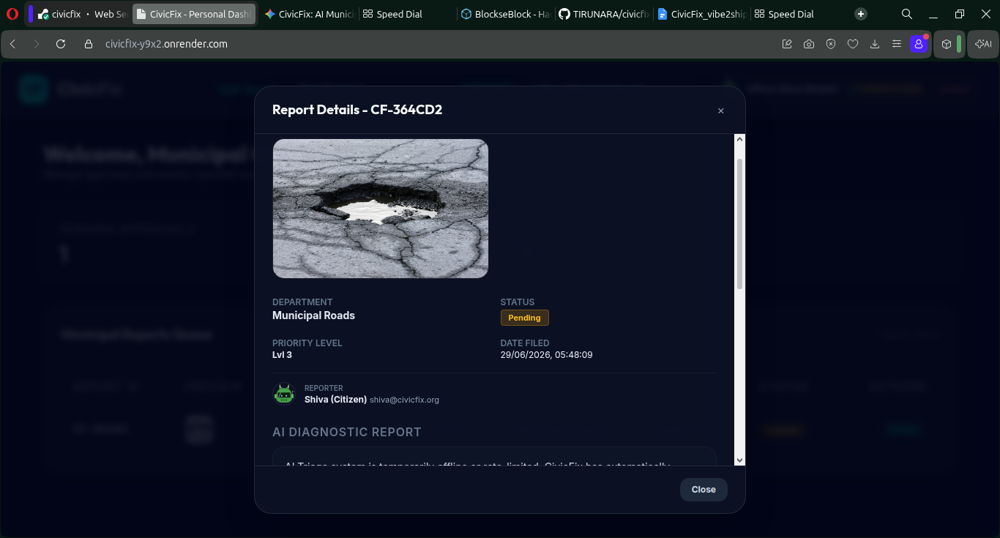

### Step 8: Inspector Dispatch & Active Tasks Execution Queue
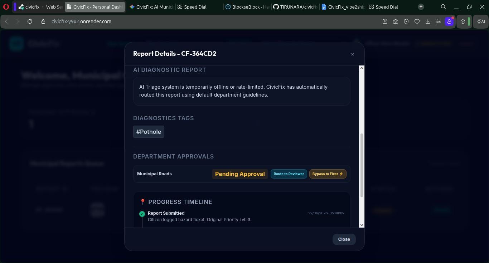

### Step 9: Field Diagnostic Log Submission Form & Materials Logger
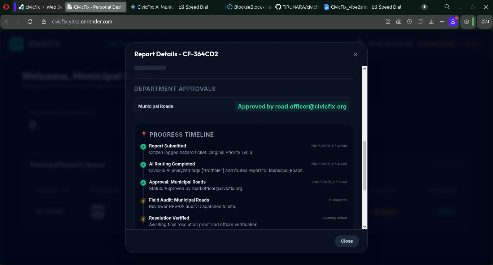

### Step 10: AI Synthesis, Resource Planning & Dispatch Specifications
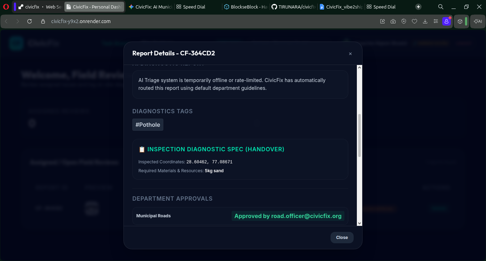

### Step 11: Fixer Crew Work Initiation Portal & Progress Tracking
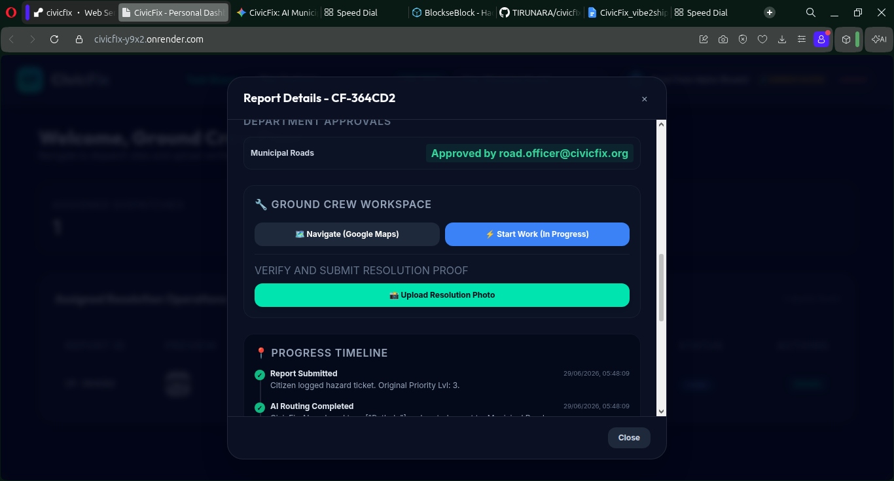

### Step 12: Active Work-in-Progress Status Update & Coordination Hub
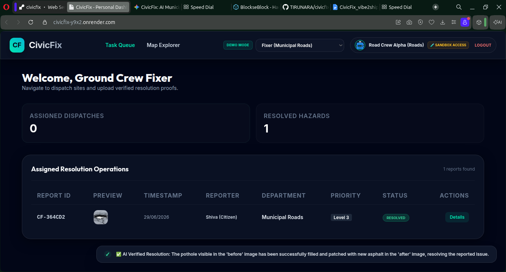

### Step 13: Work Completion Proof Submission & Before-After Uploads
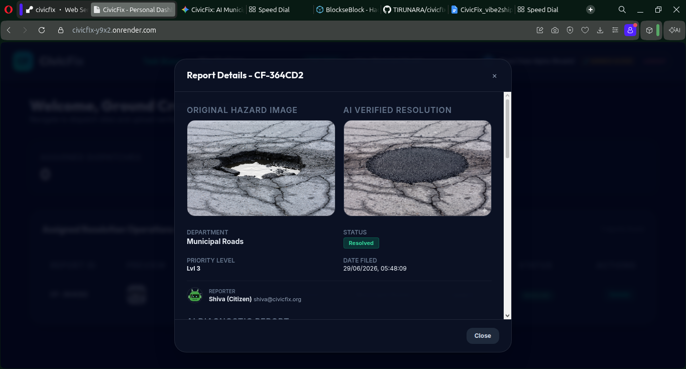

### Step 14: Gemini Multimodal Comparative Verification & Ticket Closure
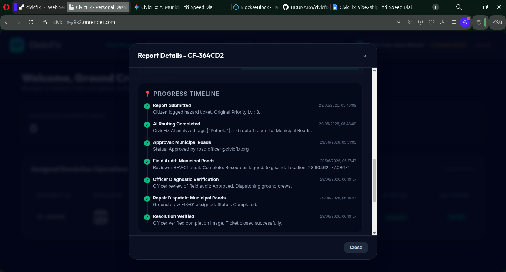

---

## 10. Getting Started

```bash
# 1. Clone the repo
git clone https://github.com/TIRUNARA/civicfix.git
cd civicfix

# 2. Create & activate virtual environment
python3 -m venv venv && source venv/bin/activate

# 3. Install dependencies
pip install -r requirements.txt

# 4. Set environment variables
export GEMINI_API_KEY="your-key-here"
export DATABASE_URL=""           # Leave empty for SQLite (local), set Neon URL for production

# 5. Run the server
uvicorn main:app --reload --port 8000
```

Visit **http://localhost:8000** — the portal is live.

---

## 11. Vibe2Ship Value Proposition

> CivicFix transcends standard CRUD ticketing — it establishes a **cognitive infrastructure layer** for modern municipal governance.

- 🚀 **Eradicates Administrative Bloat** — Autonomous triage, routing, and resource planning free up municipal budgets for actual repairs.
- 🔐 **Enforces Accountability** — Dual-Loop Verification ensures no contractor can claim completion without AI-verified visual proof.
- ⚡ **Delivers Immediate ROI** — Direct-Dispatch compresses emergency response from weeks to hours.

---

<div align="center">

**Built for Vibe2Ship Hackathon · Powered by Gemini 2.5 · Made with ❤️ by TIRUNARA**

</div>
