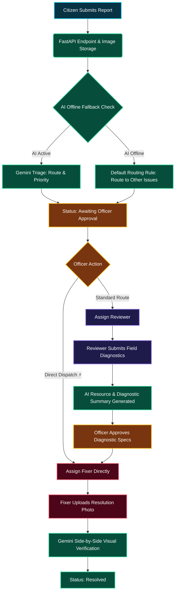

# 🛡️ CivicFix: Smart Municipal Infrastructure Portal & Double-Loop AI Resolution Engine

## 1. Executive Summary & Vision
**CivicFix** is a next-generation, high-performance municipal incident response platform designed to automate and streamline the lifecycle of urban hazard resolution. The platform bridges the gap between citizens reporting local issues—such as potholes, overflowing waste, sewage leaks, or electrical hazards—and municipal government divisions. 

Built with a **Double-Loop AI Verification Engine** powered by Gemini 2.5 and designed around strict role-based access gates, CivicFix eliminates administrative friction, optimizes inspector dispatch, coordinates multi-department tasks, and provides visual, auditable validation for every completed repair.

---

## 2. Core Problem & Solutions

### The Bottleneck
Traditional citizen-reporting applications act as simple digital suggestion boxes. They suffer from several critical weaknesses:
1. **Manual Classification Delays**: City staff must manually review photos, leading to backlog queues.
2. **Incorrect Department Routing**: Reports are frequently sent to wrong teams, causing weeks of delay.
3. **Lack of Field Resource Planning**: Field crews arrive on site without knowing what materials, tools, or staff size are required.
4. **Resolution Fraud & Incomplete Work**: Crews report issues as fixed without auditable visual confirmation.
5. **Single-Point Failure**: If modern cloud APIs or AI nodes go offline, the entire queue stalls.

### The CivicFix Solution
*   **Double-Loop AI Triage & Verification**: Gemini automates image classification on submission (generating tags, routing departments, calculating priority levels, and estimating resolution SLAs) and performs side-by-side comparative validation of before-and-after images upon task completion.
*   **Decoupled Workflow & Direct Dispatch**: Municipal officers have the autonomy to choose standard verification pathways or initiate immediate **Bypass to Fixer ⚡** direct dispatch for high-priority hazards.
*   **Role-Based Security Hardening**: Sensitive data (department chats, AI internal diagnostic summaries, raw server logs, severity scores) are securely gated from citizen accounts.
*   **Offline Fallback Resilience**: The system detects API timeouts or key limits, immediately defaulting to standard offline municipal routing rules rather than failing or showing diagnostics exceptions to users.

---

## 3. Role-Based Security Matrix

The table below outlines the strict permissions, capabilities, and system visibility enforced across all four active profiles:

| User Role | Dashboard Actions | Platform Visibility Gates | Target Objective |
| :--- | :--- | :--- | :--- |
| **Citizen (Public)** | Submit reports, upload hazard photos, upvote nearby issues, view resolved tickets. | **Restricted**: Cannot view departmental chat, severity metrics, inspector reports, or AI logs. | Report neighborhood hazards, track public resolution progress transparently. |
| **Officer (Admin/Supervisor)** | Approve departments, route tasks, assign reviewers, direct-dispatch to fixers, view AI summaries, sign off on repairs. | **All Access**: Full visibility of department chats, diagnostics, resource checklists, and system logs. | Direct municipal operations, allocate budgets, moderate communications, and verify repairs. |
| **Reviewer (Field Inspector)** | Access assigned inspection queue, record GPS coordinates, log required crew resources/materials, upload field photos. | **Staff Access**: Limited to assignment details, inspector chats, and active diagnostic reports. | Verify the hazard's dimensions, log logistics/materials required, and record precise field telemetry. |
| **Fixer (Repair Crew)** | View assigned repair tasks, download reviewer material specifications, view exact location, upload resolved photos. | **Crew Access**: Access restricted to assigned fixer cards and direct task status updates. | Perform physical site repairs, gather required resources, and submit proof of completion. |

---

## 4. Multi-Stage Workflow Lifecycle

The following diagram illustrates the path of a ticket from citizen submission to double-loop verification:

---

## 5. Architectural Resilience: Offline Fallback Engine

> [!IMPORTANT]
> The platform is built around the principle of **uninterrupted utility operation**. 

If the primary Gemini API key is rate-limited, expired, or disconnected, the backend catches the exception at the middleware level:
1. **Fallback Triage**: Instead of locking the report in `Failed` or `Processing` status, the report is instantly marked as `Pending`, routed to the fallback department (`Other Issues`), and assigned a baseline priority level `3`.
2. **Safe Messaging**: All stack traces and debug exceptions are caught and sanitized. The public user sees a reassuring status description:
   > *"AI Triage system is temporarily offline or rate-limited. CivicFix has automatically routed this report using default department guidelines."*
3. **Officer Manual Override**: The officer gets immediate control to manually change departments or bypass to fixer assignment, keeping municipal workflows moving without interruption.

---

## 6. Technical Stack

*   **Core API Gateway**: `FastAPI` (Python) providing lightweight, high-performance, asynchronous routing and data validation.
*   **Database Engine**: Serverless `Neon PostgreSQL` for cloud deployments, with a local `SQLite` WAL configuration for local development.
*   **AI Integration**: `Google GenAI SDK` (Gemini 2.5 Flash) for image triage, priority allocation, diagnostic summarization, and side-by-side verification.
*   **Design System**: A sleek, dark glassmorphism dashboard styled entirely in **Vanilla CSS3**, optimizing render speeds, compatibility, and responsiveness.
