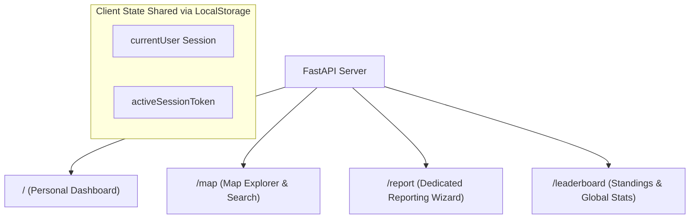

# CivicFix Multi-Page Platform Upgrade Design Specification

*   **Date**: 2026-06-24
*   **Version**: 1.0
*   **Target Workspace**: `/home/integrity/Desktop/agent/civicfix`
*   **Status**: Pending Review & Implementation Plan

---

## 🧭 I. Product Architecture & Page Flow

We are decomposing the single-page CivicFix dashboard into a multi-page web application to separate specialized user journeys (Exploration vs. Reporting vs. Standings) while preserving high-performance backend endpoints.



### 1. Routes Mapping
*   **`/` (Dashboard)**: Served via `templates/dashboard.html`. Focuses on user-specific reported issues, active statuses, and detailed resolution views.
*   **`/map` (Map Explorer)**: Served via `templates/map.html`. A full-bleed map explorer containing address autocomplete, spatial layers, and multi-category filters.
*   **`/report` (Report Hazard)**: Served via `templates/report.html`. A focused, high-fidelity multi-stage reporting interface supporting image uploads, AI analytics preview, and mobile coordinate overrides.
*   **`/leaderboard` (Citizen Standings)**: Served via `templates/leaderboard.html`. Standings board displaying gamified points, global resolution counters, and participant profiles.

---

## 🎨 II. UI/UX Design System & Theme

To elevate CivicFix to a professional-grade webapp, we are refining the glassmorphic dark-mode palette. This addresses WCAG contrast compliance and aligns styling across all pages.

### 1. Accessible Dark Theme Constants
```css
:root {
  --bg-primary: #020617;        /* Slate 950: deep, modern dark background */
  --bg-secondary: #0b0f19;      /* Slate 900: panel background */
  --bg-tertiary: #1e293b;       /* Slate 800: input and inner card backgrounds */
  
  --accent-primary: #00E5B0;    /* Accessible Emerald/Teal (passes 4.7:1 WCAG ratio) */
  --accent-hover: #00c294;      /* Muted teal for states */
  
  --text-primary: #f8fafc;      /* Slate 50: clear headings and body text */
  --text-secondary: #94a3b8;    /* Slate 400: readable descriptive text */
  --text-muted: #64748b;        /* Slate 500: meta metadata labels */
  
  /* Status Semantics */
  --status-pending: #f59e0b;    /* Amber 500: Pending Review */
  --status-review: #3b82f6;     /* Blue 500: Under Review */
  --status-progress: #ef4444;   /* Red 500: Work In Progress */
  --status-resolved: #10b981;   /* Emerald 500: Verified Resolved */
}
```

### 2. Global Typography & Elements
*   **Fonts**: Inter (Sans-serif) for high-density readable text; Outfit (Sans-serif) for primary headers to retain modern branding.
*   **Borders**: All cards use a semi-transparent subtle border (`border-white/10` or `border-slate-800`) and a slight glass backdrop filter (`backdrop-blur-md`).
*   **Focus Ring**: Any keyboard focus highlights elements with `ring-2 ring-[#00E5B0] ring-offset-2 ring-offset-[#020617]`.

---

## 🏛️ III. Detailed Page Layouts

### 1. Personal Dashboard (`/`)
*   **Layout**: A layout structured into a header, stats grid, and uploads container.
    *   *Logged Out View*: A premium landing hero with statistics counters and prominent Google Login/Mock Login buttons.
    *   *Logged In View*: Welcome message and personalized card metrics (Total Submitted, Resolved, Leaderboard Points, Rank).
*   **Uploads Hub**: A data-dense table view showing matching user-reported issues. Columns: ID, Image preview, Timestamp, Department, Status Badge.
*   **Detail Panel**: Clicking a row opens a details panel showing before/after image slider (if resolved), AI diagnostic details (tags, department, analysis text), and action buttons.

### 2. Map Explorer (`/map`)
*   **Layout**: Split-pane layout.
    *   *Left Sidebar (350px, Collapsible)*:
        *   **Fuzzy Address Search**: Search bar with address autocomplete querying OpenStreetMap Nominatim.
        *   **Filters**: Checklist for My Uploads Only, Status, Department, and Priority range.
    *   *Right Map (Remaining width)*:
        *   Dark map canvas using CartoDB dark tiles.
        *   **Geospatial Controls**: Leaflet zoom controls, map scale bar, live coordinates indicator in font-mono.
        *   **Markers**: Status-colored markers with optimized hover tooltips (text-only metadata, no heavy image overlays) and detailed popup widgets on click.

### 3. Reporting Wizard (`/report`)
*   **Layout**: Centered, single-focused wizard box.
    *   *Step 1: Intake*: Large drag-and-drop file target. Interactive camera capture. Prominent QR code section with description: "Scan to upload directly from your mobile device."
    *   *Step 2: AI Processing*: Custom progress loader. Calls `/api/reports/analyze` and updates progress logs.
    *   *Step 3: Verification*: Form pre-filled with AI diagnostic outputs (tags list, department select, priority, AI description box) and dynamic coordinates input. Allows users to type additional notes. Clicking "Register Hazard" submits the report and redirects to `/`.

### 4. Leaderboard (`/leaderboard`)
*   **Layout**: Gamified leaderboard cards highlighting the top 3 podium contributors with custom avatar containers.
*   **Leaderboard Table**: Searchable and paginated list of contributors with scores, total reports, and verification metrics.
*   **Global Counters**: Sticky cards displaying total municipal hazard fixes verified by AI.

---

## ♿ IV. Accessibility (A11y) & Performance Enhancements

Following the accessibility and cartography audits, we are integrating these hard rules:
1.  **Z-Index Standards**: Map wrapper set to `z-0`. Floating sidebars set to `z-10`. Dynamic modal layers set to `z-50`. Prevents map mouse captures on top-level elements.
2.  **Focus Trap Modals**: All modals feature focus trapping to prevent keyboard navigation escaping the dialog boundary. Includes `role="dialog"` and `aria-modal="true"`.
3.  **Large Touch Targets**: All buttons, links, inputs, and toggles have a minimum click size of 44×44px with a minimum target pad.
4.  **Premium Global Loading**: Replaces raw alert alerts with a custom, sleek spinner panel displaying status logging ("Acquiring Geolocation...", "Awaiting Gemini Diagnostics...", "Report Registered!").
5.  **Offline & Media Safeguards**: All preview and avatar images use native browser `loading="lazy"` tags. Form drafts are persisted via `sessionStorage` to prevent input loss during accidental reloads.

---

## 🛠️ V. Database & Route Implementation Plan

To enable this layout change, we will add template routers to `main.py` and implement the corresponding HTML documents inside the `templates/` directory.

```python
# Template routers to be added:
@app.get("/", response_class=HTMLResponse)
async def serve_dashboard():
    with open("templates/dashboard.html", "r") as f:
        return HTMLResponse(content=f.read())

@app.get("/map", response_class=HTMLResponse)
async def serve_map():
    with open("templates/map.html", "r") as f:
        return HTMLResponse(content=f.read())

@app.get("/report", response_class=HTMLResponse)
async def serve_report():
    with open("templates/report.html", "r") as f:
        return HTMLResponse(content=f.read())

@app.get("/leaderboard", response_class=HTMLResponse)
async def serve_leaderboard():
    with open("templates/leaderboard.html", "r") as f:
        return HTMLResponse(content=f.read())
```
